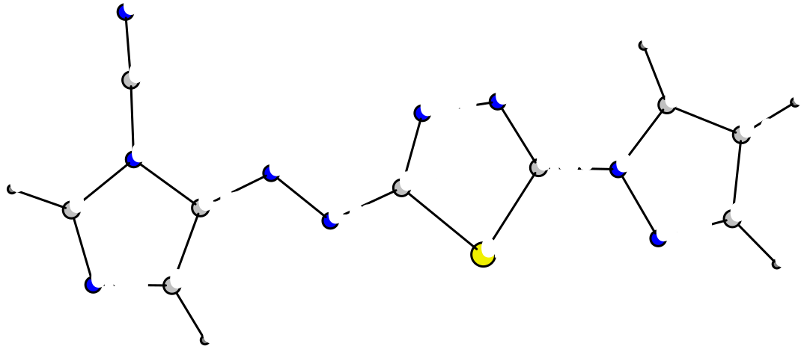

# xyz2svg

Lightweight script to make vector images of molecules

## Requirements
- `python>=3.6`
- [briling/v](https://github.com/briling/v) or something capable of printing atom positions and connectivity


## Basic usage

```
v mol/caffeine.xyz | ./mol2svg.py > caffeine.svg
```
Open an xyz file with `v`, rotate the molecule as you like and press `p`, then `x` to exit


## Input file modification
For a water dimer
```
v mol/kj-H2O_1--H3O+.xyz > input/kj-H2O_1--H3O+.inp
```
prints
```
atom   8   -1.1697501   -0.1527130    0.0202511
atom   1   -1.8639331    0.4812310   -0.1588469
atom   1   -1.6335311   -0.9640680    0.2263131
atom   8    1.1960949    0.3707430   -0.0773079
atom   1    0.2351029    0.2036530   -0.0496909
atom   1    1.6046709    0.2360230    0.7985351
atom   1    1.6313459   -0.1748690   -0.7592539
bond   1   2
bond   1   3
bond   4   5
bond   4   6
bond   4   7
```
This file contains atomic numbers and coordinates in Å and list of bonds (base 1).
We can add a hydrogen bond between atoms 1–5:
```
bond 1 5 -1
```
(see [input/kj-H2O_1--H3O+.inp](input/kj-H2O_1--H3O+.inp)). Then 
```
./mol2svg.py < input/kj-H2O_1--H3O+.inp > figures/kj-H2O_1--H3O+.svg
```
gives<br>


One can also add (positive or negative) bond orders ([input/caffeine_v2.inp](input/caffeine_v2.inp)):


## Drawing options

Run 
```
./mol2svg.py --help
```
to get help:
```
  --num                                                 add atom numbers
  --elements                                            add element symbols
  --canvas-size CANVAS_SIZE                             basic canvas size (default 80)
  -wa ATOM_BORDER, --atom-border ATOM_BORDER            atom border width (default 5.0)
  -wb BOND_WIDTH, --bond-width BOND_WIDTH               bond width (default 5.0)
  -db BOND_DISTANCE, --bond-distance BOND_DISTANCE      line distance in multiple bonds (default 0.05)
  -rs ATOM_SIZE, --atom_size ATOM_SIZE                  scaling factor for atom radii
  -r%d ATOM_%d_RADIUS                                   sets basic radius for a specific element (in Å)
  -g, --gradient                                        fill atoms with radial gradients (pseudo-3D mode)
  --fog                                                 enable fog for depth perspective
  --fog-strength FOG_STRENGTH                           fog strength (default 0.8, between 0.0 and 1.0)
  --light-hydrogen                                      use a lighter color for H
  --cpk                                                 use CPK coloring scheme
  -fs FONT_SIZE, --font-size FONT_SIZE                  font size (default 24)
  -fn FONT_NAME, --font-name FONT_NAME                  font name (default monospace)
  --bond-color BOND_COLOR                               bond line color (default black - hex)
  --atom-stroke-color ATOM_STROKE_COLOR                 atom stroke color (default black - hex)
  --text-stroke-color TEXT_STROKE_COLOR                 text stroke color (default white - hex)
  --text-color TEXT_COLOR                               text fill color (default black - hex)
  --text-weight TEXT_WEIGHT                             text weight (default bold)
  --text-style TEXT_STYLE                               text style (default normal)
  --text-stroke-width TEXT_STROKE_WIDTH                 text stroke width (default 8)
  --value-gradient VALUE_GRADIENT VALUE_GRADIENT        starting and finishing colors for value gradient (default ["#000000", "#FF0000"]
  --value-radius VALUE_RADIUS                           radius of value gradient circles (default 0.2 Å)
```
The same caffeine with options:
```
./mol2svg.py -rs 3.5 -wa 10 -wb 10 -db 0.1 < input/caffeine_v2.inp > figures/caffeine_v3.svg
```


### @iribirii's pseudo-3D mode:
```
./mol2svg.py -rs 3.5 -wb 10 -g < input/caffeine.inp > figures/caffeine_v4.svg
```


### @aligfellow's fog depth perspective option:
```
./mol2svg.py -wb 10 --fog --fog-strength 0.8 -wa 4 < input/C60-Ih.inp > figures/C60-Ih.svg
```


- currently incompatible with gradiented 3D mode

### Extended input

Add values to atoms, e.g.
```
label 1     0.009
```
to add them as text:
```
./mol2svg.py < input/C3-7-6-7_v2.inp > figures/C3-7-6-7_v2.svg
```



Add ghost atom coordinates and corresponding values, e.g.
```
value   4.3721492    1.2190677   -0.9878959    0.009
```
to add circles representing them:
```
./mol2svg.py -rs 2.5  --value-gradient '#00FF00' '#FF0000' < input/C3-7-6-7_v3.inp > figures/C3-7-6-7_v3.svg
```

